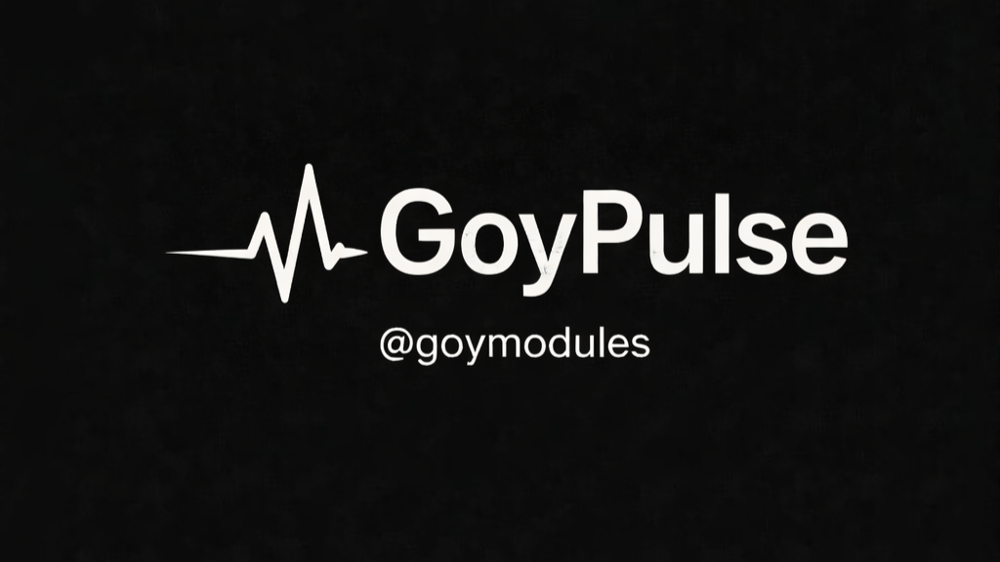
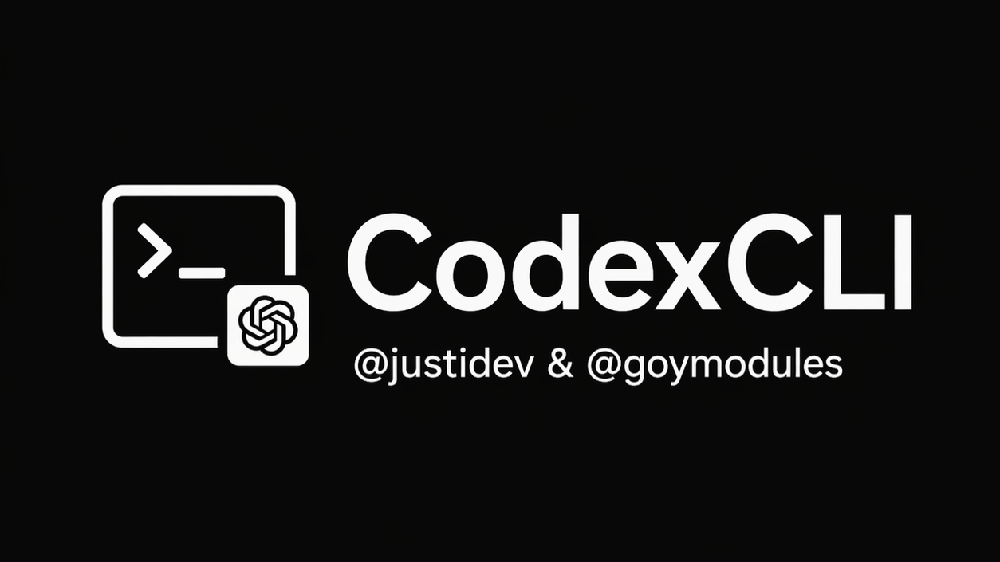

  
  
  
  

## Featured
<table>
  <tr>
    <td align="center" width="50%">
      
       <strong>GoyPulse</strong>
       Utility • Watcher • 12 cmds
       <code>.gpulse</code> <code>.gpstat</code> <code>.gpset</code>
    </td>
    <td align="center" width="50%">
      
       <strong>GoySecurity</strong>
       Security • Watcher • 10 cmds
       <code>.gscan</code> <code>.gscanall</code> <code>.gai</code>
    </td>
  </tr>
  <tr>
    <td align="center" width="50%">
      
       <strong>QwenCLI</strong>
       CLI / AI • Watcher
       <code>.qwinstall</code> <code>watcher</code>
    </td>
    <td align="center" width="50%">
      
       <strong>CodexCLI</strong>
       CLI / AI • Watcher
       <code>.cdxinstall</code> <code>watcher</code>
    </td>
  </tr>
</table>

## Categories
<table>
  <tr>
    <td align="center" width="33%"> GoySecurity • KeyScanner • Recon</td>
    <td align="center" width="33%"> YTMusic • SoundCloudMusic</td>
    <td align="center" width="33%"> CodexCLI • QwenCLI • OmniLoad</td>
  </tr>
</table>

## Quick access
<table>
  <tr>
    <td align="center" width="33%"><a href="./readme_ru.md"><strong>RU index</strong></a> Russian docs</td>
    <td align="center" width="33%"><a href="./readme_en.md"><strong>EN index</strong></a> English docs</td>
    <td align="center" width="33%"><a href="https://t.me/goymodules"><strong>Telegram</strong></a> updates</td>
  </tr>
</table>

## Full catalog

| Module | Category | Cmds | Watcher | Preview | Docs |
|---|---|---:|---:|---|---|
| GoyPulse | Utility | 12 | ✅ | `assets/goypulse.png` | [RU](./readme_goypulse_ru.md) / [EN](./readme_goypulse_en.md) |
| GoySecurity | Security | 10 | ✅ | `assets/goysec.png` | [RU](./readme_goysec_ru.md) / [EN](./readme_goysec_en.md) |
| QwenCLI | CLI / Tools | watcher | ✅ | `assets/QwenCLI.png` | [RU](./readme_qwencli_ru.md) / [EN](./readme_qwencli_en.md) |
| CodexCLI | CLI / Tools | watcher | ✅ | `assets/CodexCLI.png` | [RU](./readme_codexcli_ru.md) / [EN](./readme_codexcli_en.md) |
| OmniLoad | CLI / Tools | 1 | ❌ | `assets/omniload.png` | [RU](./readme_omniload_ru.md) / [EN](./readme_omniload_en.md) |
| Recon | Security | watcher | ✅ | `assets/recon.png` | [RU](./readme_recon_ru.md) / [EN](./readme_recon_en.md) |
| KeyScanner | Security | watcher | ✅ | `assets/keyscanner.png` | [RU](./readme_keyscanner_ru.md) / [EN](./readme_keyscanner_en.md) |
| YTMusic | Music | 7 | ✅ | `assets/ytmusic.png` | [RU](./readme_ytmusic_ru.md) / [EN](./readme_ytmusic_en.md) |
| SoundCloudMusic | Music | 7 | ✅ | `assets/soundcloudmusic.png` | [RU](./readme_soundcloudmusic_ru.md) / [EN](./readme_soundcloudmusic_en.md) |
| Doom | Fun | 2 | ❌ | `assets/doom.png` | [RU](./readme_doom_ru.md) / [EN](./readme_doom_en.md) |
| GoyVirus | Utility | watcher | ✅ | `assets/goyvirus.png` | [RU](./readme_goyvirus_ru.md) / [EN](./readme_goyvirus_en.md) |

# GoyModules Docs — EN

**GoyModules** is a curated module pack for Hikka and Heroku, plus compatible userbot forks, created by Goy. The goal is practical day-to-day usage: clear commands, predictable behavior, and production-ready workflows.

## Module catalog
- [GoyPulse](./readme_goypulse_en.md) — Markov-based smart autoreply with per-chat memory, training controls, and backup tooling.
- [GoySecurity](./readme_goysec_en.md) — pre-install security scanner with risk explanations, history, whitelist, and AI-based insights.
- [OmniLoad](./readme_omniload_en.md) — one-command media downloader for links and direct repost workflows.
- [QwenCLI](./readme_qwencli_en.md) — AI command center for chat and automation tasks, including dependency bootstrap via `.qwinstall`.
- [CodexCLI](./readme_codexcli_en.md) — Codex-focused AI module, collaboratively maintained as a QwenCLI fork (contact: [@justidev](https://t.me/justidev)).
- [Doom](./readme_doom_en.md) — inline DOOM mini-game directly inside Telegram.
- [Recon](./readme_recon_en.md) — recon/OSINT toolkit for collecting technical metadata about targets and infrastructure.
- [KeyScanner](./readme_keyscanner_en.md) — API key scanner/validator for chats with auto-catch, export, and provider-based stats.
- [SoundCloudMusic](./readme_soundcloudmusic_en.md) — SoundCloud search/downloader with local playlist database management.
- [YTMusic](./readme_ytmusic_en.md) — YouTube music workflows with playlist management and import/export features.
- [GoyVirus](./readme_goyvirus_en.md) — humorous prank module intended for playful use with friends.

## Quick route
- Entry point: `README.md`
- English index: `readme/readme_en.md`
- Then open the target module README and follow its step-by-step setup.

## Language switch
- [Русская документация](./readme_ru.md)

## License
All docs and modules in this project are protected under **GNU AGPLv3**. Details: [LICENSE](../LICENSE).
