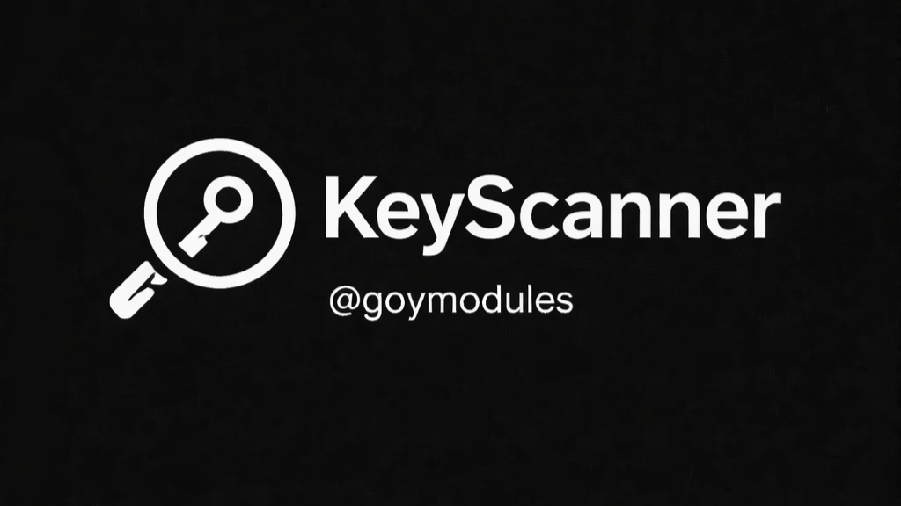

# GoyModules — EN

  
  
  

  

  

<a href="../README.md"><strong>Root</strong></a> • <a href="./readme_ru.md"><strong>RU</strong></a>

## Modules

Tap a card — it opens the target module `readme` directly.

<table>
  <tr>
    <td align="center" width="50%">
      
       <strong><a href="./readme_goypulse_en.md">GoyPulse</a></strong>
       Utility • Watcher
       Smart Markov-based autoreply engine.
       <a href="./readme_goypulse_en.md"><strong>Open README</strong></a>
    </td>
    <td align="center" width="50%">
      
       <strong><a href="./readme_goysec_en.md">GoySecurity</a></strong>
       Security
       Module scanner before installation.
       <a href="./readme_goysec_en.md"><strong>Open README</strong></a>
    </td>
  </tr>
  <tr>
    <td align="center" width="50%">
      
       <strong><a href="./readme_qwencli_en.md">QwenCLI</a></strong>
       CLI / AI • Watcher
       AI module for chat and automation.
       <a href="./readme_qwencli_en.md"><strong>Open README</strong></a>
    </td>
    <td align="center" width="50%">
      
       <strong><a href="./readme_codexcli_en.md">CodexCLI</a></strong>
       CLI / AI • Watcher
       Codex-focused dev workflow module.
       <a href="./readme_codexcli_en.md"><strong>Open README</strong></a>
    </td>
  </tr>
  <tr>
    <td align="center" width="50%">
      
       <strong><a href="./readme_omniload_en.md">OmniLoad</a></strong>
       CLI / Tools
       Fast media downloader by link.
       <a href="./readme_omniload_en.md"><strong>Open README</strong></a>
    </td>
    <td align="center" width="50%">
      
       <strong><a href="./readme_recon_en.md">Recon</a></strong>
       Security / OSINT
       Recon and infra overview toolkit.
       <a href="./readme_recon_en.md"><strong>Open README</strong></a>
    </td>
  </tr>
  <tr>
    <td align="center" width="50%">
      
       <strong><a href="./readme_keyscanner_en.md">KeyScanner</a></strong>
       Security • Watcher
       API key scanner and validator.
       <a href="./readme_keyscanner_en.md"><strong>Open README</strong></a>
    </td>
    <td align="center" width="50%">
      
       <strong><a href="./readme_ytmusic_en.md">YTMusic</a></strong>
       Music
       YouTube tracks and playlists.
       <a href="./readme_ytmusic_en.md"><strong>Open README</strong></a>
    </td>
  </tr>
  <tr>
    <td align="center" width="50%">
      
       <strong><a href="./readme_soundcloudmusic_en.md">SoundCloudMusic</a></strong>
       Music
       SoundCloud search and local playlists.
       <a href="./readme_soundcloudmusic_en.md"><strong>Open README</strong></a>
    </td>
    <td align="center" width="50%">
      
       <strong><a href="./readme_doom_en.md">Doom</a></strong>
       Fun
       DOOM mini-game inside Telegram.
       <a href="./readme_doom_en.md"><strong>Open README</strong></a>
    </td>
  </tr>
  <tr>
    <td align="center" width="50%">
      
       <strong><a href="./readme_goyvirus_en.md">GoyVirus</a></strong>
       Fun / Utility
       Humorous prank module.
       <a href="./readme_goyvirus_en.md"><strong>Open README</strong></a>
    </td>
    <td width="50%"></td>
  </tr>
</table>

