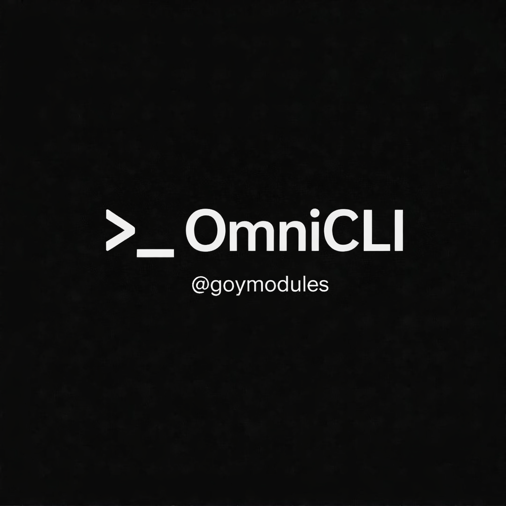

# OmniCLI — README EN



OmniCLI is a multi-provider AI command module based on QwenCLI architecture, with Omni-prefixed command surface and provider orchestration workflows.

## File
- `OmniCLI.py`

## Install
```bash
.dlm https://raw.githubusercontent.com/sepiol026-wq/GoyModules/main/OmniCLI.py
```

## Core commands
- `.om` — main prompt command.
- `.ominstall [all|qwen|codex|gemini|claude]` — install local runtime/provider CLIs.
- `.omauth [status|qwen|codex|gemini|claude|all]` — auth status and provider auth guides.
- `.om*` — full Omni command family mirrored from QwenCLI (`.omclear`, `.ommem*`, `.omauto`, `.omprod`, etc.).

## Notes
- Qwen runtime flow is fully retained and moved to Omni command namespace.
- External provider installers/auth guides are bundled in OmniCLI for all-in-one bootstrap.
